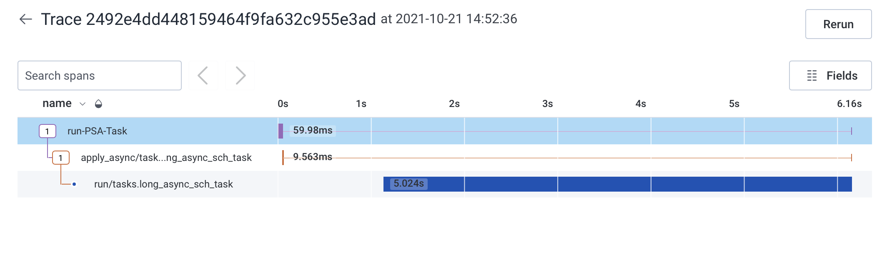

# flask_sync_async
Tutorial showing scenarios about synchronous and asynchronous requests in Python.

This is also a showcase of instrumentation for OpenTelemetry, specifically configured to feed events to https://honeycomb.io

## OpenTelemetry discussion
OpenTelemetry is a project that, among other things, supports mechanisms for creating trace/span events to be fed to a supporting backend.  This application is used to showcase instrumentation of the OTEL libraries to support tracing through application requests and propagation into asynchronous celery workers.

The files of note for instrumentation are as follows:
```
common.py       # This is the OTEL client
app_async3.py   # The selected example for instrumentation, has trace/span creation at the / of the site and the API for running async tasks for Celery
tasks.py        # We initialize a client for use by Celery worker tasks 
init.py         # A common pattern for initialization of application constructs, in this case where we call OTEL Autoinstrumentation to instrument the app
```

Worth noting is that `common.otel_init()` is called twice - once to initialize an OTEL client for use by the application, and once to initialize an OTEL client for use by the celery workers.  The reason this is done is to get the full picture of the asynchronous call between the Flask app and the Celery task that is run.  While this application expects a callback from the asynchronous task, it may be the case that tasks in other applications do not.  For this reason the Flask application should not be the authority of the span that is created in the asynchronous task.

Autoinstrumentation that is called in `common.py` handles the propagation of the trace context between the application request and the Celery worker task.  Thus we can hand both the client and let the instrumentation do the work for us of building the larger, contextual picture.  You should see something like:



## Getting started
First install virtualenv by `pip install virtualenv`
If pip is not configured on your syste please refer to https://pip.pypa.io/en/stable/installation/

Setup your virtualenv in the root of the project by calling:
```
$ virtualenv -p python3 venv
```
**NOTE: if python3 is not installed please install and make it available**

Once your virtualenv is setup you can source it and install dependencies:
```
$ . venv/bin/activate
$ pip install -r requirements
```

## Running the app
**NOTE: requires redis installed and running on localhost, else change the connection string in the config files**

Open two terminal sessions and in each source the virtuelenv as above.  One will be used to run the Celery daemon, and another the app.

In one run:
```
$ celery -A tasks worker --loglevel=DEBUG
```

In the other run:
```
$ python app_async3.py
```

You may run other app*.py files for other tests, but the app_async3 is the one instrumented for OTEL today
